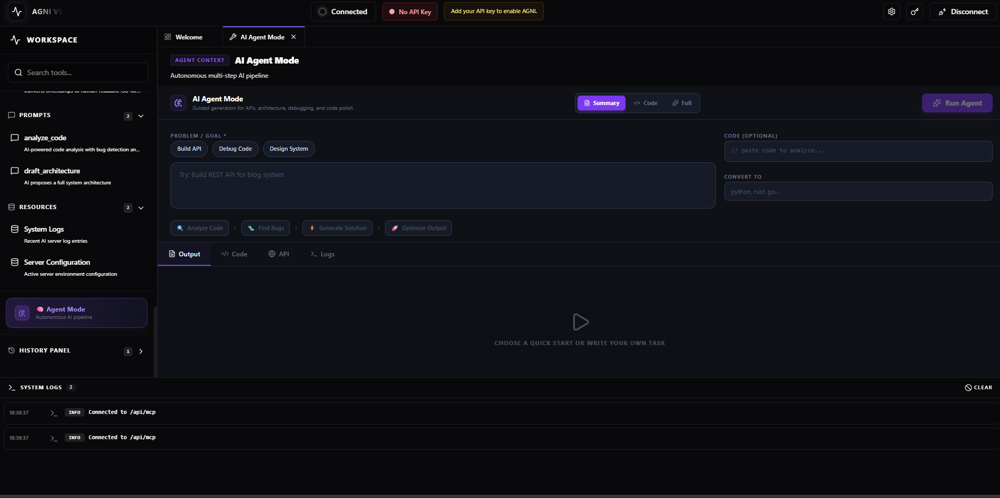
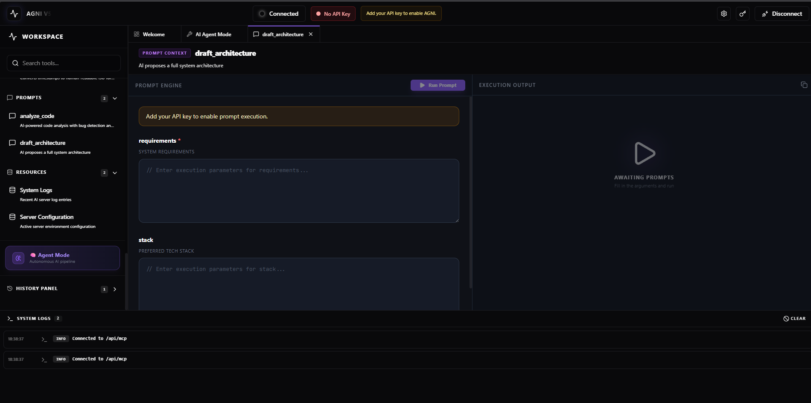
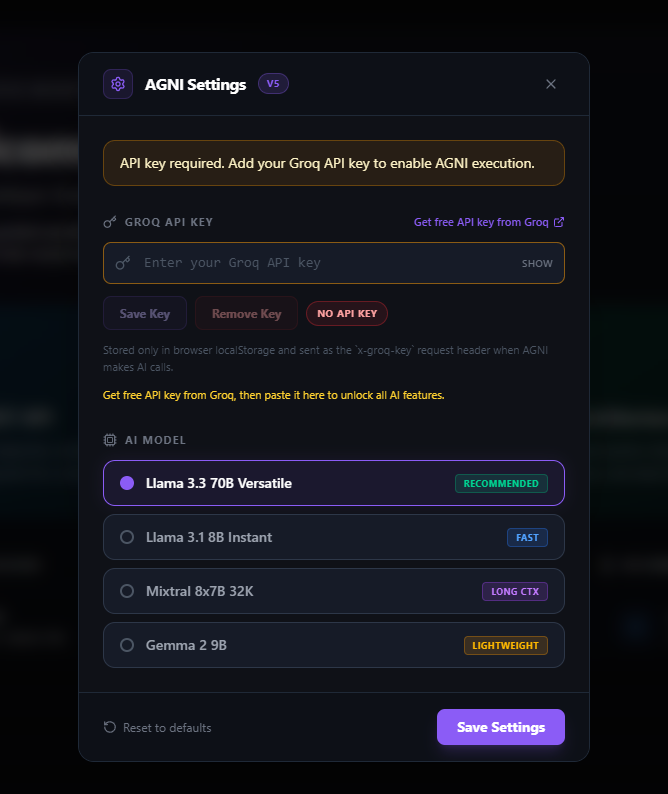

# ⚡ AGNI AI — Developer Workspace

> Your AI-powered developer workspace to build, analyze, and ship faster — without context switching.

---

## 🚀 Live Demo

🔗 https://agni-ai-cyan.vercel.app

---

## 🧠 What is AGNI?

AGNI is a powerful AI developer workspace that brings multiple AI tools into a single unified interface.

Instead of switching between ChatGPT, docs, and tools — AGNI lets you:

* ✨ Generate code
* 🔍 Analyze existing code
* 🧠 Design system architecture
* ⚙️ Run developer tools
* 📊 Work with APIs & data
* 💬 Chat with AI

All in one place.

---

## 🧩 Core Features

### 💻 Code Tools

* `generate_code` → Production-ready code generation
* `analyze_code` → Detect bugs & anti-patterns
* `optimize_code` → Improve performance
* `convert_code` → Convert between languages

---

### 🌐 API Tools

* `fetch_api_data` → Call real APIs
* `test_endpoint` → Validate endpoints
* `generate_request` → Auto-build API requests

---

### 📊 Data Tools

* `parse_json` → Parse & validate JSON
* `format_json` → Beautify JSON
* `csv_to_json` → Convert CSV to JSON

---

### 🤖 AI Tools

* `chat_with_ai` → Conversational AI
* `summarize_text` → Summarize content
* `generate_email` → Draft emails
* `resume_analyzer` → ATS-based resume insights

---

### 🗄️ Database Tools

* `run_sql_query` → Simulate SQL queries
* `generate_schema` → Create DB schema
* `optimize_query` → Improve queries

---

### ⚙️ Utility Tools

* `calculate_expression` → Evaluate math expressions
* `generate_uuid` → Secure UUIDs
* `format_date` → Format timestamps

---

## 🧠 Architecture

```
Frontend (Next.js - Vercel)
        ↓
API Proxy (/api/mcp)
        ↓
Backend (Express MCP Server - Render)
        ↓
Groq API (BYOK)
```

---

## 🔐 BYOK (Bring Your Own Key)

AGNI uses a **BYOK model**:

* Users provide their own Groq API key
* No shared API usage
* Fully secure & scalable

---

## ⚙️ Tech Stack

### Frontend

* Next.js (App Router)
* Tailwind CSS
* React Context API

### Backend

* Node.js
* Express.js
* MCP Architecture

### Deployment

* Vercel (Frontend)
* Render (Backend)

### AI

* Groq API (Llama Models)

---

## 📦 Installation (Local Setup)

### 1. Clone repo

```bash
git clone https://github.com/Divyanshuchouhan00/agni-ai.git
cd agni-ai
```

---

### 2. Backend setup

```bash
cd mock-mcp-server
npm install
npm start
```

---

### 3. Frontend setup

```bash
cd agni-mcp-inspector
npm install
npm run dev
```

---

## 🌍 Deployment

### Backend (Render)

* Root: `mock-mcp-server`
* Start command: `node index.js`

### Frontend (Vercel)

* Root: `agni-mcp-inspector`
* Env:

```
NEXT_PUBLIC_MCP_URL=/api/mcp
```

---

## 🔥 Key Engineering Decisions

* ✅ MCP architecture for modular AI tools
* ✅ Proxy routing to eliminate CORS issues
* ✅ BYOK for scalability & cost control
* ✅ Tool-based execution system
* ✅ Agent-style workflow

---

## 📸 Screenshots






---

## 📈 Future Plans

* 🧠 AI Agent Mode (auto workflow execution)
* 💰 Monetization (credits system)
* 🧑‍🤝‍🧑 Team collaboration
* 📊 Usage analytics dashboard

---

## 🤝 Contributing

Pull requests are welcome. For major changes, open an issue first.

---

## 📜 License

MIT License

---

## 👨‍💻 Author

**Divyanshu Chouhan**

* GitHub: https://github.com/Divyanshuchouhan00

---

## ⭐ Show Your Support

If you like this project:

👉 Star the repo
👉 Share it
👉 Build something with AGNI

---

# 🚀 AGNI is Live

> Build faster. Think deeper. Ship smarter.
